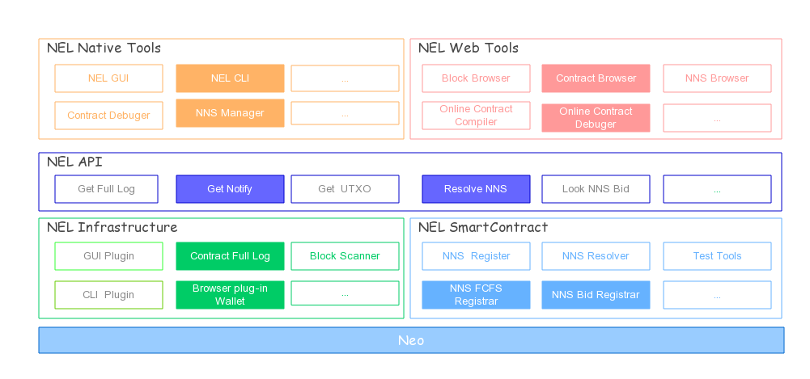

# NEL项目介绍

本项目包含了NEL开发的主要项目的说明文档，可点击本项目内不同目录查看不同项目说明。

## NEL简介

NEL（NewEconnoLab）是NEO生态的中国开发志愿者社区。我们致力于培养社区开发人才，推动项目落地。

## NEL技术框架图

## NEO开发技术学习

NEL 搭建了多种交流平台 

### NEL区块链技术交流平台

主QQ群：377076520

程序员QQ群：690086107

论坛:https://bbs.neldev.net/

NEL新经济实验室 微信号： NewEconoLab

### NEO开发技术学习手册
[传送门](study/study.md)

