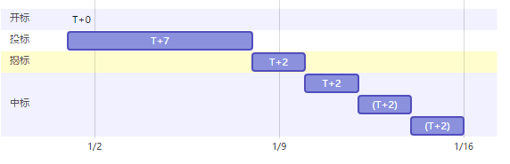

# Neo域名服务(Neo Name Service)技术白皮书

参考文档
>[NNS系统概述](system.md)
>
>[NameHash算法详解](namehash.md)
>
>[NNS协议规范](protocol.md)

## 名词定义
### 域名服务
&emsp;&emsp;域名服务旨在将钱包地址、智能合约Hash等人类难以记忆的无规则的字符串用单词短语简写等代替。
通过域名服务，人们再也不用记忆看不懂的地址和Hash，只要知道一个单词或一个短语就能进行转账、使用合约。   
&emsp;&emsp;域名命名格式参照大家熟知的DNS规范，用英文句号分割各个组成部分,
各个组成部分别从右往左为顶级域名、二级域名、N级域名。
### 域名与协议
   &emsp;&emsp;以url http://www.abc.test 为例,http 是协议,www abc test 为域名，test是根域名或者顶级域名,
abc称为二级域名,www称为三级域名，不限制域名的级数，但是通常以二级域名和三级域名最为常用
### 顶级域名
&emsp;&emsp;以url http://www.abc.test 为例，test就是顶级域名，顶级域名不可直接访问，http://test 无效。

&emsp;&emsp;顶级域名又称为根域名。

&emsp;&emsp;用户通过顶级域名对应的智能合约，进行各种操作。
### 子域名
&emsp;&emsp;顶级域名不是任何人的子域名，二级域名是顶级域名的子域名，三级域名是二级域名的子域名，以此类推。
在我们的系统里，用户可以取得的最高层级是二级域名，二级域名的注册器可以将二级域名所属的三级域名分配给其他人。
### 所有者
&emsp;&emsp;根域名的所有者和注册器都由管理员控制。

&emsp;&emsp;除顶级域名外，每一层域名的所有者可以是账户地址或者智能合约。
比如：二级域名的所有者可以设置自己的二级域名使用的注册器与解析器。
二级域名所属的三级域名的所有权，需要通过二级域名的注册器分配。

&emsp;&emsp;所有者不能直接分配三级域名的所有权。这需要取决于所有者设置的注册器的行为。

&emsp;&emsp;所有者代表一级域名的所有权。

&emsp;&emsp;当所有者是一个智能合约时，可以实现复杂的所有权控制，比如双人签名，多人投票等机制
### 注册器
&emsp;&emsp;注册器负责分配一个域名的子域名。
比如test顶级域名的注册器是一个先到先得注册器，任何人可以向该注册器所要未分配的与过期的二级域名。
neo顶级域名的注册器会是采用拍卖的系统进行分配。

&emsp;&emsp;注册器代表对子域名的分配策略。

&emsp;&emsp;如果二级域名的所有者设置了一个有所有者手工配置的注册器，那么二级域名所属子域名的分配权全部有所有者手工配置。

&emsp;&emsp;如果二级域名的所有者设置了一个先到先得注册器或者拍卖注册器，那么等同于放弃了二级域名所属子域名的控制权，让大家自由申请子域名。
### 有效期
&emsp;&emsp;除顶级域名外，每一个二级域名都有有效期，注册器在分配域名时指定，注册器分配的最大有效期不得超过注册器自己所在域名的有效期。

&emsp;&emsp;过期域名可以被再次分配，要维持所有权，可以在未到期前通过注册器重置有效期。

---

## 服务构成

---

### 竞标服务
竞标服务以确定谁有权注册某一个二级域名为服务目标。服务进程分为四个阶段（以1月1日开标为例）:

#### 开标
&emsp;&emsp;任意未被注册或已过期且不违反域定义的域名都可被任意标准地址（账户）申请开标。一旦开标即意味着该域名的所有权投标开始。
#### 投标
&emsp;&emsp;投标由开标启动，为期7天，在这段时间内任意标准地址（账户）可以提交一个加密的报价，此过程并不需要为此支付任何保证金。投标人通过发送报价附加其自定义的一组8位任意字符的32位sha256散列值作为报价用以隐藏真实报价，以防止没有必要的恶性竞争。投标人不足1人，竞标自动结束，域名立即进入可开标状态。
#### 揭标
&emsp;&emsp;投标过程结束后进入48小时的揭标过程。在此期间，投标人需要提交报价的明文和加密字符串明文，用以验证揭标人没有更改投标报价。在此过程中，投标人需提交与报价等额的保证金。在此过程中，如果投标人没有揭标，视为放弃竞标。揭标人不足1人，竞标自动结束，域名立即进入可开标状态。
#### 中标
&emsp;&emsp;揭标结束后，进入中标过程。确定出价最高的前三揭标人，确认为第一、第二、第三中标人，每个中标人有48小时中标权。中标权首先赋予第一中标人，第一中标人48小时内未领取域名所有权，则中标权赋予第二中标人，以此类推。如果所有中标人均没有在48小时内领取域名所有权，竞标流标，相关域名立即进入可开标状态。中标人支付报价后，即获得该二级域名356天的所有权。中标人行驶中标权，则保证金自动支付竞标报价；中标人放弃中标权，则保证金将自动退回。

---

### 注册服务
#### 域名Hash方法
&emsp;&emsp;所有域名都将通过此方法转换为固定32位长度的字节数组
#### 查询方法
&emsp;&emsp;查询方法支持输入域名，输出域名所有者publickey的hash
#### 二级域名注册方法
&emsp;&emsp;在竞标中获胜中标的中标人将自动被注册为二级域名的所有权人，即登记员。
#### 子域名注册方法
&emsp;&emsp;域名登记员可以授予任意标准地址（账户）其子域名的管理权。同样，登记员可以转移、注销子域名管理权。
#### 域名解析器设置方法
&emsp;&emsp;域名管理员可以设置域名对应的解析器地址（scripthash），每个二级域名或子域名只能有唯一一个解析器。
#### 二级域名转让方法
&emsp;&emsp;域名登记员可以自行将自己的域名所有权转让给一个标准地址（账户）。一旦执行，不可撤销。域名所有权转移后，其有效期计算不变（仍以中标时间计算）。
#### 注销方法
&emsp;&emsp;域名登记员可以自行注销二级域名，即立即放弃对二级域名的所有权，也就代表此域名立即进入可开标状态。一旦执行，不可撤销。二级域名注销会连带强制注销与其关联的所有子域名和解析器设置。

---

### 解析服务（规范）
&emsp;&emsp;NEL会提供一些常用的解析器（如地址、合约hash等），任何人也可以自行定义解析器，但是必须符合一定规范以实现兼容。
#### 查询方法
&emsp;&emsp;查询方法支持输入域名，输出解析值（如地址、合约hash等）。
#### 修改方法
&emsp;&emsp;域名管理员可以设置域名的解析值。
#### 删除方法
&emsp;&emsp;域名管理员可以删除域名解析值，没有设置解析的域名将返回0地址。

---

### 交易服务  
&emsp;&emsp;交易服务支持域名登记员发布域名所有权转让邀约，对域名有获取需求的人可以进行竞标，其过程类似于竞标服务。  

---

## 域名浏览器
&emsp;&emsp;域名浏览器通过监听所有域名服务智能合约执行中发送的通知，记录各项域名业务活动。支持任何人查看域名注册情况、子域名分配情况、域名管理情况、域名解析情况、域名竞标情况、域名交易情况等完备信息。

---

## 域名价值量化
&emsp;&emsp;NEL会发行一种NEP5代币，暂定名NNSV（NNS价值），以此对域名价值进行量化。所有域名服务涉及的费用均由NNSV支付或消费。测试阶段，NEL会以接受申请的方式发放NNSV。正式阶段，发放方式依据测试情况和反馈确定。

---

## 技术路线图
- 2017.12.XX 正式发布NNS技术白皮书
---
- xxxx.xx.xx 完成技术原理测试和验证
- xxxx.xx.xx 在测试网发布包括注册器、解析器的NNS第一阶段测试服务，任何人可以注册未被注册且符合规则的域名
- xxxx.xx.xx 发布基于测试网的域名浏览器V1
- xxxx.xx.xx 在测试网发行NNSV
- xxxx.xx.xx 在测试网发布包含竞标服务的NNS第二阶段测试服务，任何人可以向NEL申请NNSV进行竞标测试域名
- xxxx.xx.xx 发布基于测试网的域名浏览器V2
---
- xxxx.xx.xx 在正式网发行NNSV
- xxxx.xx.xx 在正式网上发布NNS正式服务，Neo域名时代来临
- xxxx.xx.xx 发布基于正式网的域名浏览器
