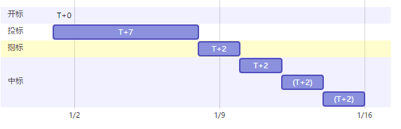

### 竞标服务
竞标服务以确定谁有权注册某一个二级域名为服务目标。服务进程分为四个阶段（以1月1日开标为例）:

#### 开标
&emsp;&emsp;任意未被注册或已过期且不违反域定义的域名都可被任意标准地址（账户）申请开标。一旦开标即意味着该域名的所有权投标开始。
#### 投标
&emsp;&emsp;投标由开标启动，为期7天，在这段时间内任意标准地址（账户）可以提交一个加密的报价，此过程并不需要为此支付任何保证金。投标人通过发送报价附加其自定义的一组8位任意字符的32位sha256散列值作为报价用以隐藏真实报价，以防止没有必要的恶性竞争。投标人不足1人，竞标自动结束，域名立即进入可开标状态。
#### 揭标
&emsp;&emsp;投标过程结束后进入48小时的揭标过程。在此期间，投标人需要提交报价的明文和加密字符串明文，用以验证揭标人没有更改投标报价。在此过程中，投标人需提交与报价等额的保证金。在此过程中，如果投标人没有揭标，视为放弃竞标。揭标人不足1人，竞标自动结束，域名立即进入可开标状态。
#### 中标
&emsp;&emsp;揭标结束后，进入中标过程。确定出价最高的前三揭标人，确认为第一、第二、第三中标人，每个中标人有48小时中标权。中标权首先赋予第一中标人，第一中标人48小时内未领取域名所有权，则中标权赋予第二中标人，以此类推。如果所有中标人均没有在48小时内领取域名所有权，竞标流标，相关域名立即进入可开标状态。中标人支付报价后，即获得该二级域名356天的所有权。中标人行驶中标权，则保证金自动支付竞标报价；中标人放弃中标权，则保证金将自动退回。

---

---

### 交易服务  
&emsp;&emsp;交易服务支持域名登记员发布域名所有权转让邀约，对域名有获取需求的人可以进行竞标，其过程类似于竞标服务。  

---