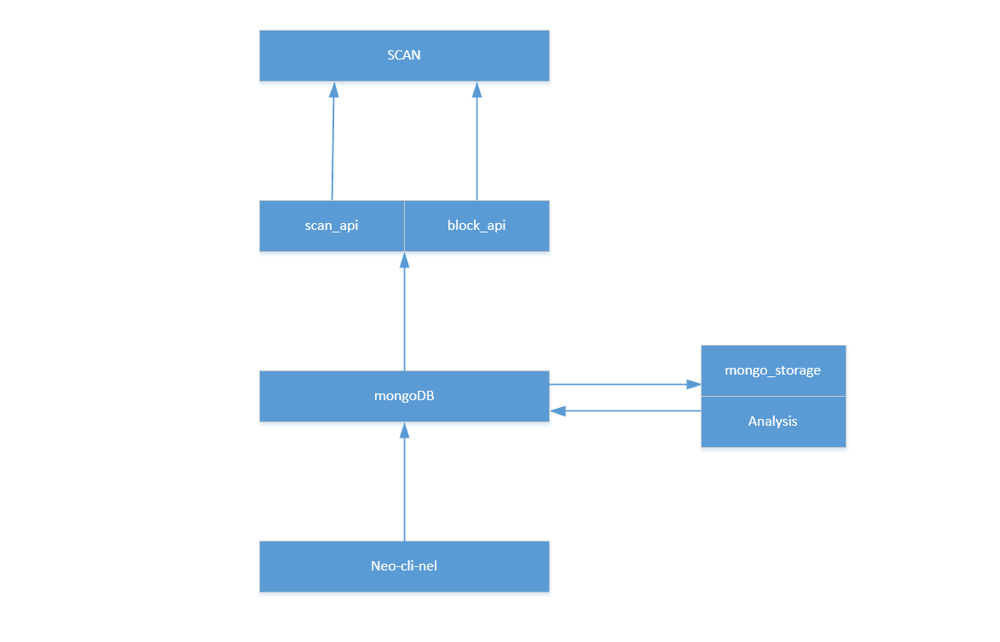

[English](#en) [简体中文](#zh)

#浏览器项目

## 项目初衷
区块链上的数据虽然是公开透明的，但是却不易查询和阅读。我们希望建立一个项目，能够将链上的数据方便快捷的展示给用户。

## 项目地址
_[传送门](https://github.com/NewEconoLab/NELBrowser-Web-React.git)_

## 能用浏览器查询什么？
 - 最新的区块高度
 - 某个区块的详情
 - 区块交易的总数
 - 某个交易的详情
 - 地址的总数
 - 某个地址的交易记录
 - 某个地址的资产情况
 - 链上的NEP5和全局资产的详情
 - NNS域名相关的所有信息
 **未完待续**

## 那些躲在浏览器背后的项目
 NEL_Scan_API : 一个专门为浏览器项目提供接口的工程 。_[传送门](https://github.com/NewEconoLab/NEL_Scan_API)_ 

 NEL_Block_API : 一个提供链上基础数据，例如块数据，交易数据等没有特别定制化数据的接口工程 。_[传送门](https://github.com/NewEconoLab/NEO_Block_API)_ 

 NeoBlock-Mongo-Storage : 一个较为基础的数据分析工程，根据块数据分析入库交易详情，资产详情等 。_[传送门](https://github.com/NewEconoLab/NeoBlock-Mongo-Storage)_ 

 NeoBlockAnalysis : 一个定制化程度较高的分析工程，根据基础数据分析构造成项目特定需要的数据格式 。_[传送门](https://github.com/NewEconoLab/NeoBlockAnalysis)_ 

 neo-cli-nel : 一个修改版的neo节点，加入了NEL特定的功能。例如合约分析，直接将链上数据存入数据库等功能 。_[传送门](https://github.com/NewEconoLab/neo-cli-nel)_ 
 
 ### 项目关系
