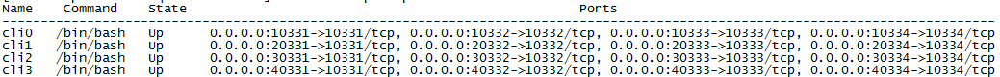
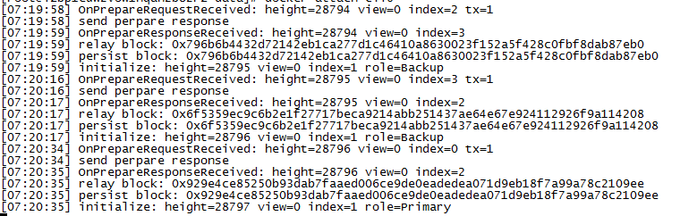
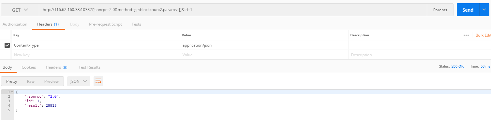
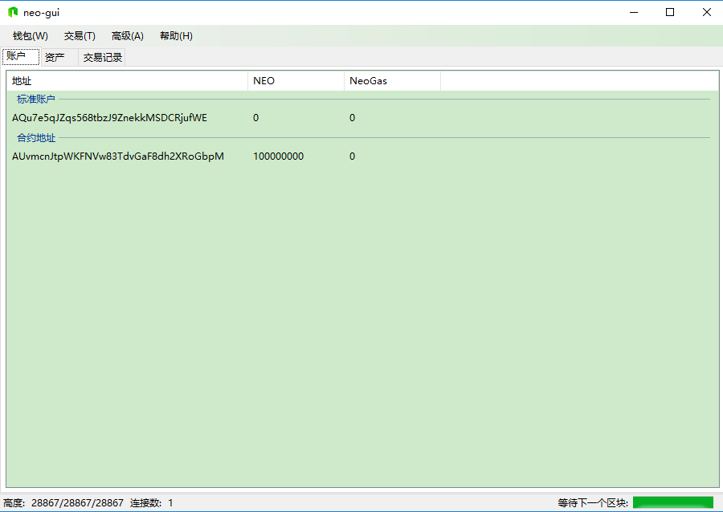
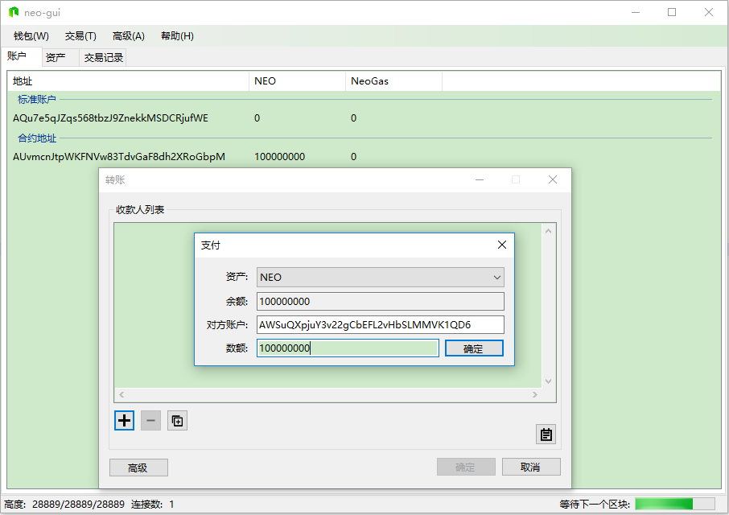
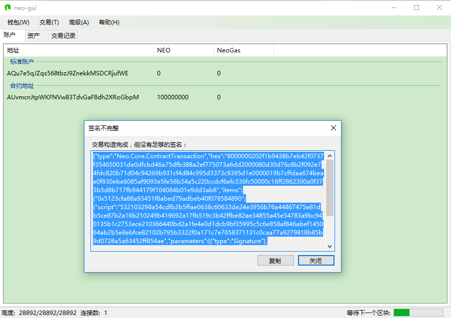
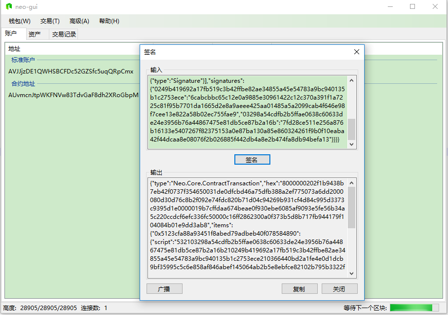
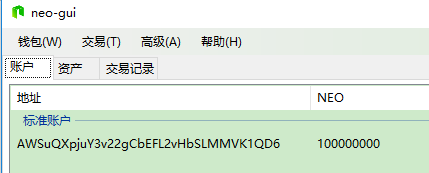

**Docker技术快速构建Neo私链**

青冥子\@NEL

是否，参加了各种Neo活动，对Neo颇感兴趣，希望从源头了解这个世界上为数不多的支持智能合约的公链？

是否，总是想参照Neo文档建立一个自己的私链，但是总是没有那么多时间去昨晚，抑或没走几步总是会遇到各种拦路虎？

是否，想研究Neo智能合约，但是苦于主网（mainnet）gas太贵，测试网（testnet）申请又太麻烦（而且一般都不那么慷慨）？

是否，希望给大家炫个富，“嘿，看，我有1亿Neo！”？

恭喜你，阅读这篇文章就能解决以上问题。请跟随笔者一步一步进行操作，每一步都是笔者的成功的操作记录，请放心食用。本教程已经预设了多项参数，在一般情况下，按照本教程操作就能立即坐拥1亿Neo并供你尽情挥霍。

本文面向私链体验者，*5步构建私链，7步Neo过亿*。

如果大侠需要详加参详或者只是想体验更简单的快速搭建Cli节点，请详阅<https://github.com/NewEconoLab/neo-cli-docker>。

以下操作以Linux指令为主：

-   **第1步，建立Docker环境**

   建议参考Docker官网https://docs.docker.com/engine/installation/构建Docker环境，具体操作不再赘述。

   Docker支持所有系统，包括Linux、Windows、Mac，Linux为原生支持。

   笔者以CentOS 7.4
   x64为实验环境，但是其他系统亦可，最终Docker层都是用CentOS的。

   服务器或虚拟机建议不要低于2u4G。

-   **第2步，引用笔者编制好的dockerfile构建Neo Cli
    Docker镜像，后面将以次为依托派生容器。**

   打开CentOS终端或使用SSH远程，输入并运行如下命令：

>   docker build -t neo-cli:v0.3 https://github.com/NewEconoLab/neo-cli-docker.git#:dockerfile/privatenet

   这条命令会从NEL的github自动应用私链镜像构建脚本，主要进行如下操作：

-   构建CentOS Docker镜像

-   安装dotnet sdk环境

-   安装Neo必须的leveldb-devel库

-   安装git

-   从Neo官方github克隆neo-cli项目最新代码

-   使用dotnet sdk编译neo-cli

-   从NEL官方github克隆neo-cli-docker项目

-   将neo-cli-docker项目中预先配置好的私链版config.json和protocol.json文件替换到neo-cli根目录

-   **第3步，安装Docker官方容器编排工具docker-compose，为后面一键派生4个记账人节点容器做准备。**

   输入并运行：

>   sudo pip install -U docker-compose

>   pip uninstall urllib3

>   pip uninstall chardet

>   pip install requests

>   docker-compose –version

-   **第4步，引用笔者预先设置好的容器编排模板一键生成Neo链最小规模的4个记账人节点容器（实际最少3个仍能继续共识出块）**

   输入并运行：

>   cd /home

>   sudo yum -y install git

>   git clone https://github.com/NewEconoLab/neo-cli-docker.git

>   cp neo-cli-docker/dockerfile/privatenet/docker-compose.yml docker-compose.yml

>   docker-compose up -d

>   docker-compose ps

   看到这个样子就表示4个记账人节点的容器已经成功启动（此时节点还未启动）

-   **第5步，分别进入容器，启动节点，打开记账人钱包，启动共识**

   输入并运行：

>   docker attach cli0 

*进入第一个容器，其后一次为cli1、cli2、cli3*
后面开始就是容器内部环境：

>   cd /home/cli && dotnet neo-cli.dll /rpc
   
*启动Cli节点*

>   open wallet ./docs/neo_private_net_0.json

 *打开记账人钱包，其后依次为*neo_private_net_1.json、neo_private_net_2.json、neo_private_net_3.json

   钱包密码123456

>   start consensus *启动共识*

   最后*切记*使用特别的组合键【Ctrl】+ (【P】-\>【Q】)，即按住【Ctrl】再依次按【P】、【Q】，退出并不停止当前容器。

   其他3个节点容器类似依次操作，不在赘述

   最后一个节点启动后，稍等片刻，可以看到私链已近开始运行：

   可以看出，主记账人角色是交替承担的

   *至此，私链已经搭建完成，后面2步是私链的应用。*

-   **第6步，通过Cli jsonRPC api查看私链运行状态**

   安装postman等api测试程序

   使用get方式请求：

>   [http://116.62.160.38:10332/?jsonrpc=2.0&method=getblockcount&params=[]&id=1](http://116.62.160.38:10332/?jsonrpc=2.0&method=getblockcount&params=%5b%5d&id=1)

   其中IP部分要替换成你的电脑或虚拟机的实际ip。

   然后就能看到当前私链总的区块数，要查看其它信息，可参考NeoCli api文档

-   **第7步，从记账人多重签名合约中取出初始块中的1亿Neo转到一个非记账人钱包中**

    -   构建能够连接当前私链的config.json和protocol.json文件

   config.json参考：

>   {

>   "ApplicationConfiguration": {

>   "Paths": {

>   "Chain": "ChainPrivate",

>   "Notifications": "NotificationsPrivate"

>   },

>   "P2P": {

>   "Port": 10333,

>   "WsPort": 10334

>   },

>   "RPC": {

>   "Port": 10332,

>   "SslCert": "",

>   "SslCertPassword": ""

>   }

>   }

>   }

   protocol.json参考：

>   {

>   "ProtocolConfiguration": {

>   "Magic": 9726190,

>   "AddressVersion": 23,

>   "StandbyValidators": [

>   "0249b419692a17fb519c3b42ffbe82ae34855a45e54783a9bc940135b1c2753ece",

>   "03298a54cdfb2b5ffae0638c60633de24e3956b76a44867475e81db5ce87b2a16b",

>   "02b795b3322f0a171c7e7658371131c0caa77a9279818b85b9d0728a5a63452ff8",

>   "0366440bd2a1fe4e0d1dcb9bf35995c5c6e858af846abef145064ab2b5e8ebfce8"

>   ],

>   "SeedList": [

>   "seed0.nel.group:10333",

>   "seed0.nel.group:20333",

>   "seed0.nel.group:30333",

>   "seed0.nel.group:40333",

>   ],

>   "SystemFee": {

>   "EnrollmentTransaction": 1000,

>   "IssueTransaction": 500,

>   "PublishTransaction": 500,

>   "RegisterTransaction": 10000

>   }

>   }

>   }

   seed0.nel.group需要替换成你的电脑或虚拟机的实际ip

-   下载笔者预制好的记账人钱包和非记账人钱包

   下载<https://github.com/NewEconoLab/neo-cli-docker> ZIP

   在/dockerfile/privatenet/docs可以找到相关文件

-   下载Neo官方GUI钱包，建议是2.6.0.0以上

   将其中config.json和protocol.json替换成以上内容，然后运行。

   打开neo_private_net_0.json 0号记账人钱包，密码123456

   可以看到一个合约地址中有1亿Neo（是不是有点小兴奋啊），这个合约地址是由4个记账人公钥构造的多重签名地址合约，需要至少3个记账人钱包签名才能转出。

-   最终转出

   新建一个新的非记账人钱包，比如neo_private_net_test_0.json

   记住它的地址，比如AWSuQXpjuY3v22gCbEFL2vHbSLMMVK1QD6

   打开0号记账人钱包，并【交易】-【转账】到上面地址

   确定后会提示签名不足

   没事，我们先把整个内容复制出来，然后打开1号记账人钱包，【交易】-【签名】对这笔转账交易进行第二人签名。

   复制输出，然后打开2号记账人钱包，【交易】-【签名】对这笔转账交易进行第三人签名。

   此时，左下角出现【广播】按钮，代表交易签名已经完备。

   点击【广播】将交易发送到私链上进行共识

   等到15秒左右，1亿Neo就到你建立的那个AWSuQXpjuY3v22gCbEFL2vHbSLMMVK1QD6地址中了。

   GAS是通过生成区块，按照Neo持有量，不断产生的。

   通过对自己地址转账，然后【高级】-【提取NeoGas】就能将GAS提取到自己地址。

*好了，至此你有用了一条新的Neo链、1亿Neo、无数Gas，开始你的表演吧。*
