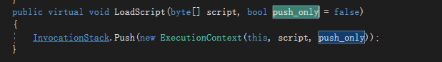
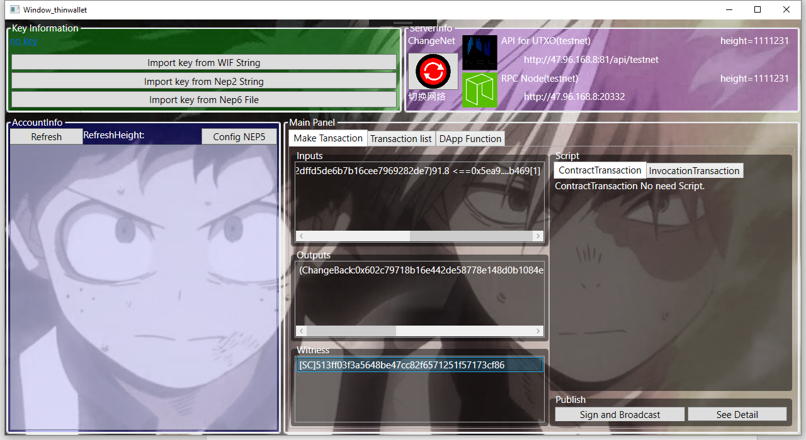
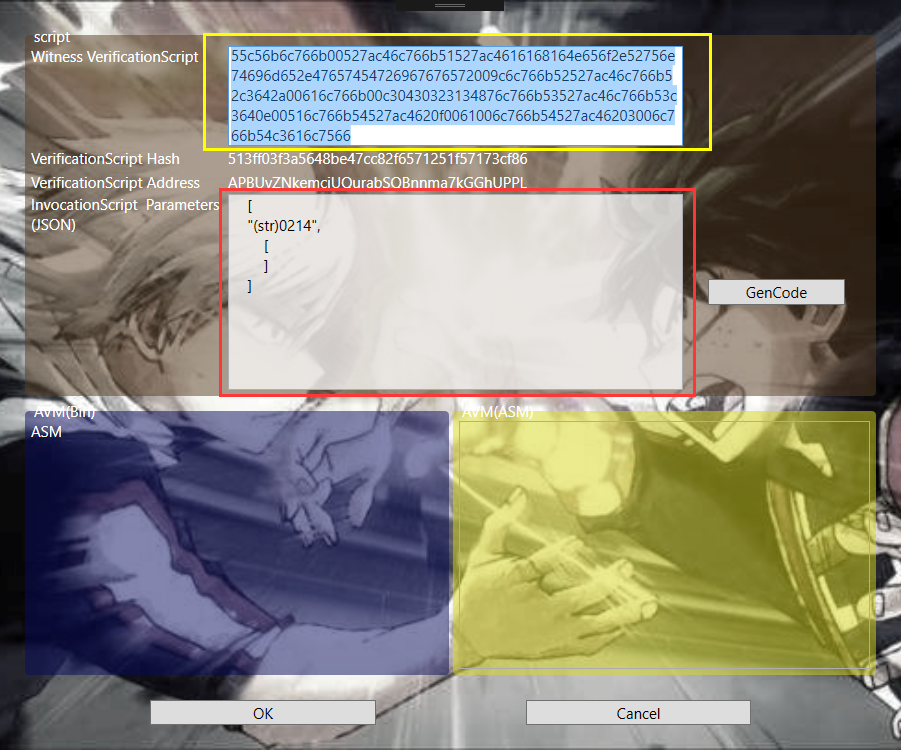
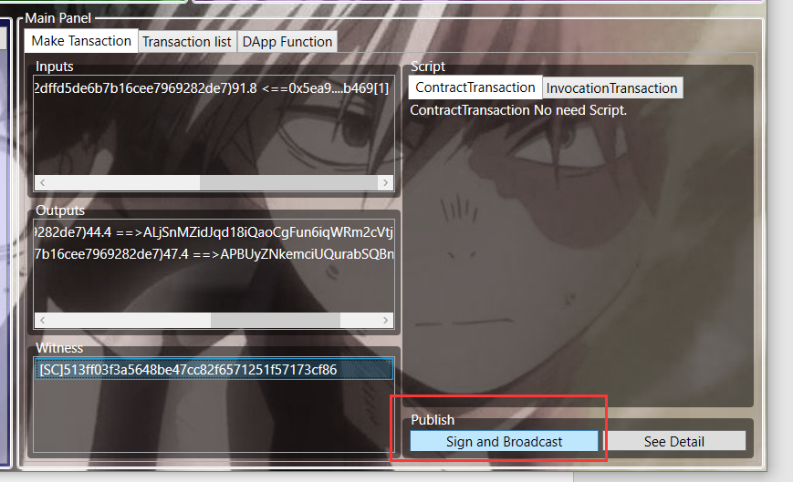

# NEO智能合约开发（一）不可能完成的任务

悬赏任务
========

兹有如下合约

>   public static object Main(string method, object[] args)  
>   {  
>   if (Runtime.Trigger == TriggerType.Verification)  
>   {  
>   if (method == "0214")  
>   return true;  
>   }  
>   return false;  
>   }

他的avm如下，他是一个鉴权合约，不需要发布他。

55c56b6c766b00527ac46c766b51527ac4616168164e656f2e52756e74696d652e47657454726967676572009c6c766b52527ac46c766b52c3642a00616c766b00c30430323134876c766b53527ac46c766b53c3640e00516c766b54527ac4620f0061006c766b54527ac46203006c766b54c3616c7566

**ScriptHash**：0x86cf7371f5511257f682cc47be48563a3ff03f51

**Address**：APBUyZNkemciUQurabSQBnnma7kGGhUPPL

在TestNet 上已经向此地址转账很多个gas了，谁拿走算谁的。

该任务在多个大牛集中的地方放了24个小时，无人拿走。称为不可能的任务名至实归。

急流勇退
========

这篇文字是一篇劝退文，劝你绕开鉴权合约的开发，先学习应用合约的开发。

官网（neo.org）文档的学习曲线已经不是陡峭，而是断崖式。

我采样了一番，居然没有发现有人跟随此文档顺利完成了鉴权合约的学习。

于是我怀着抱着满满的对自己学习能力的自信，去攀登这做陡峭的大山，打算学成归来再教你们如何学习鉴权合约。

我回来了，也是断崖上跳下来的。

这两笔是我从悬赏账户里面取出来的钱。

那么我成功了？部分成功，在尝试使用NEOGUI取这两笔钱的路上，我完全凉了。

我使用的是NEL Thinsdk-cs
的例子钱包取出来的(<https://github.com/NewEconoLab/neo-thinsdk-cs>)

完成这个任务之后，我才得出了如下结论：

>   建议大家绕开鉴权合约的开发，先学习应用合约的开发。

其难度主要在于需要理解的概念多，neogui配合不足。如果你看到这里，还是毫不气馁，坚持要攀登这座大山，我们一起往后谈。

密码合约：
==========

悬赏合约是一个密码合约

>   public static object Main(string method, object[] args)  
>   {  
>   if (Runtime.Trigger == TriggerType.Verification)  
>   {  
>   if (method == "0214")  
>   return true;  
>   }  
>   return false;  
>   }

他只有在第一个参数为0214，并且Runtime.Trigger==Verification时，返回true。

对鉴权合约来说，返回true这笔交易才能成立。

想起来很简单，从哪里传入这个0214呢？这就得把整个交易和鉴权合约这一块都说一说了。

鉴权合约与交易
==============

鉴权合约是在交易验证阶段执行的，如果鉴权合约没有返回true，那么这笔交易直接验证失败，无法被写入区块，也就不可能查询到这笔交易。

鉴权合约和应用合约有着本质上的不同，应用合约一定是验证成功写入的区块中执行。

NEO交易有输入和输出。这是UTXO模型的事情，交易的输入是一个列表，其中每一项是对一个UTXO的引用。交易的输出是制造新的UTXO。

交易的输入输出就是钱，销毁输入，制造输出，对UTXO迷糊的同学可以不用看了，拐回去搞清楚UTXO。

交易包含如下内容：

1.  输入列表

2.  输出列表

3.  如果是应用合约交易，还有应用合约脚本，其他交易还有些别的

这些共同构成未签名合约。

你是不是发现了，没有鉴权合约什么事情啊？鉴权合约呢？

你记得签名么？你一定知道给别人转账，要用你的私钥，对交易进行签名吧。

这其实，就是鉴权合约的一种特例。

1.取决于一个交易有几个输入地址（也就是出钱的人），就必须有几个对应的见证人（witness）。

2.对交易进行签名，就是添加对应转账发起人的见证人

3.NEO是一个完整的智能合约系统，每一个见证人都是两段脚本，一段叫校验脚本，一段叫执行脚本。

以上三点是不是有些晕乎，别急，还有更晕乎的

签名详解
========

1.NEO的每一个账户地址都是一段脚本，该脚本是一个两条指令的智能合约，伪代码为:

Push publickey

Syscall Checkwitness

该脚本的hash值就是用户地址，通常用户地址用该hash值加盐加验证做base58之后的字符串形式表达。字符串形式和hash值完全等价。

由此可知，NEO的地址，就是智能合约的hash值。反过来也成立，NEO每个智能合约的hash值，都是一个地址。

所以，我可以向一个智能合约转账，也可以从一个智能合约取钱，因为我的地址，其实也是一个智能合约地址。

2.见证人的校验脚本就是该地址对应的智能合约，且不可修改，hash不一样通不过校验。

3.见证人的执行脚本是用来像校验脚本提供参数的智能合约。

所以我们再来看从我的地址给别人转账发生了什么。

1.给别人转账，必须输入里面由来自我的地址的utxo

2.构造交易

3.添加见证人，校验脚本就是我的脚本

4.设置见证人执行脚本，他是一个一条指令的智能合约，伪代码为：

Push signdata

5.发送包含交易数据和见证人数据的rawdata

6.校验交易，执行脚本 push signdata，结束，校验脚本 push
自己的pubkey，然后checksig，该函数两个参数，正好是signdata 和
pubkey，检查，如果成功，交易成立。否则交易不成立。

签名是不是比你想的要复杂很多呢。

拿走悬红
========

搞清楚见证人和交易的关系之后，我们才可能顺利的从悬赏合约中拿走钱

那就构造一笔转账交易

输入n个，从悬赏合约地址里找到utxo 做输入

输出1，给自己的地址

输出2可选：可以给悬赏地址找零

见证人：校验脚本=悬赏合约

执行脚本=参数

因为参数为一个 string 一个array

倒叙push

伪代码为

Push0 //加入0

Pack // 用上面的0 创建array，表示空array

Push bytes(”0214“.as bytes())//push ”0214“

二进制为：00c10430323134

信息都告诉你了，那么拼个自定义合约就行了呗。

NEOGUI不是有工具吗，F12调出，是的，去测试吧，保证愉快。你就能理解断崖式学习曲线是怎么回事了。

而且就算你上面都做对了，你也拿不走。

我在此处纳闷了很久，然后我一行行的跟进了NEO底层

这有一个限制，执行脚本里面只能允许push指令，否则直接脚本执行失败了，鉴权合约失败，交易不成立。

我们刚才的执行脚本伪代码为

Push0 //加入0

Pack // 用上面的0 创建array，表示空array

Push bytes(”0214“.as bytes())//push ”0214“

二进制为：00c10430323134

有一个pack，超出允许范围，交易一定失败。

那么我们知道了，鉴权合约里面是没办法引用array 类型的参数了。

好在悬赏合约的第二个参数其实没有使用，随便推个啥就行

我们把执行脚本改为

Push0 //加入0

Push bytes(”0214“.as bytes())//push ”0214“

二进制为：000430323134

好了，如果你很有耐心，去玩NEOGUI 和 F12吧。

没有发布？
==========

你如果看了一些NEO智能合约的资料，你也许会发现，这个合约没发布呀。

智能合约是不需要发布的，智能合约是不需要发布的，你可以直接调用，没问题。

那么什么情况要发布呢，这个智能合约要被appcall
调用的话，他必须被发布到链上，支付昂贵的费用。应用合约基本上都是这种，为了方便反复调用，还有内部存储。

加上所有这些，从应用合约入门，还是比鉴权合约入门简单很多。

鉴权合约不用发布。

另一个客户端是怎么回事
======================

这是NEL（一个 NEO中国开发者社区 组织）

为了开发轻钱包准备的 sdk的例子

C\#版本

<https://github.com/NewEconoLab/neo-thinsdk-cs>

typescript版本

<https://github.com/NewEconoLab/neo-thinsdk-ts>

我们来演示一下，用这个例子钱包，如何更顺畅的学习鉴权合约

NEL公众号有发布过这个钱包转账的方法

<http://www.cnblogs.com/crazylights/p/8338117.htm>

启动c\#例子
-----------

点下面的 thinWallet test,就是一個轻钱包测试了

因为我们取悬红，其实并不需要loadkey，就是打开钱包，我们不需要任何人签名就能把钱给取了

从悬赏合约地址取得utxo
----------------------

在Input区域点右键，可以用智能合约增加一个UTXO

将悬红合约copy进来，或者点击loadavm 从avm读取

则可以看到合约的地址显示在下边

然后点refresh utxo，可以得到宣红合约的utxo，选一个

我们选91.8这个

然后看到输入有了

输出多了一个（changeback）表示是找零，我们是好青年，不全拿走

见证人（witness）也自动添加了一个（sc）是智能合约简称

加个输出，转给自己
------------------

在输出区域 右键，添加一个输出

填好转给谁，币种（gas），多少

然后输出自动调整找零

试试签名发出，发不出去，告诉你见证人的执行脚本还没配置

配置见证人
----------

选中见证人，在见证人区域 右键

黄色是校验脚本，他就是悬赏合约本身，不可以修改

红色是执行脚本的配置，我们用一个json替代不直观的配置

String 加了点规则

(str)开头表示这是个字符串

(int)开头表示这是个biginteger

还有(bin)(int160)(int256)

很好懂吧。

点击Gencode 就生成了执行脚本，但是我们已知，带Array的执行脚本不允许，改一下。

好，点ok

回来点签名并广播

Done，成功，

得到一个交易id对话框

交易成功
--------

随便去哪里查，都可以看到悬红里的钱已经取出了。

写在最后
========

悬红里还留了很多钱，留给那些想要探索的人，请不要一次取完。
