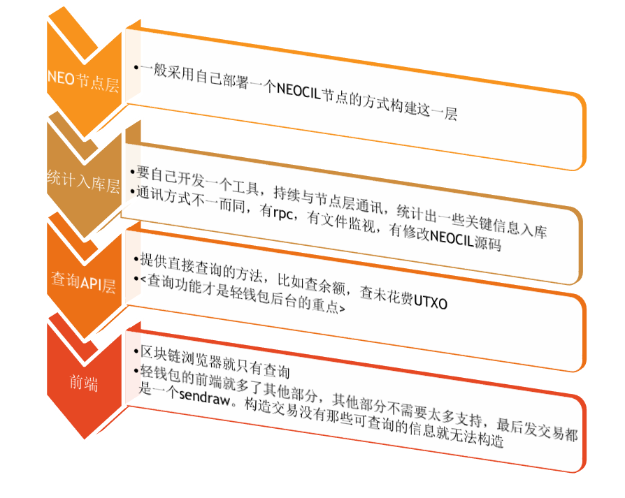

学习NEO开发 如何进阶
====================

撰写这些文字，是为了给那些即将开始学习NEO开发又有一些茫然的开发者所准备的资料。

首先，如果你还不能清晰的理解UTXO，如果你还不能熟练使用
NEOGUI，如果你还不能搞清楚Mainnet
testnet的区别，如果你还不能搞清楚NEO区块链浏览器和NEO的关系，那你现在不应该看这些文字。好高骛远、空中楼阁，不是一个好的开始。

恭喜你，已经了解了NEO，想要进行NEO的开发了。这是一条充满了挑战，也充满了机遇的开发者之路。

NEO开发是一个很笼统的说法，实际上，他完全无法说明你在干什么，你要什么。

首先，NEO是一个区块链底层技术及周边生态的一揽子概念。

对于这样一个庞大的概念，必须先把它分解一下。

我们可以大体把针对NEO的开发划分为三个大方向

一、NEO底层技术

二、NEO DAPP应用

三、NEO周边应用

一、NEO底层技术
===============

NEO底层技术的范畴依然挺大的，包括但不限于：数据库技术、p2p组网技术、加密算法、共识机制、编译器技术、NeoVM。

选择NEO底层技术你可以做什么？

1.  你可以自己开发区块链底层，从NEO技术中得到启发。

2.  你可以改进NEO核心的缺点，解决NEO核心的BUG，从核心的角度参与NEO生态建设。

3.  你可以更全面的了解智能合约的执行细节

由于这个方向难度要求大，能走到这个阶段的开发者，培训资料对你已经不具备什么意义。这个阶段的开发者会成为各个组织争相招揽的对象，我们NEL也非常欢迎你的加入。也因此NEL的培训资料的重点不会放在NEO底层技术上。

二、NEO DAPP应用
================

NEO DAPP
的应用是大家最关注的话题，NEL会全力推广DAPP开发技术，提供DAPP开发资料，以技术支持、资金等多种模式支持DAPP的开发。

DAPP的应用大家都关注的一点是：

智能合约开发
------------

没错，智能合约开发是DAPP应用开发的核心能力，NEL的培训资料以及NEL社区的很大一部分工作，就是推广NEO智能合约开发技术。

但是，一定要说但是，单独学习NEO智能合约开发技术，是远远不够的。

要想运作一个DAPP，如下技术也是必不可少的。实际上为了智能合约的顺利学习以及理解其在dapp中的核心地位，如果你在其它技术方向上毫无建树，学习智能合约开发无疑是痴人说梦。

轻钱包开发技术
--------------

是的，你没看错，开发DAPP一定需要轻钱包开发技术，而轻钱包开发技术的基础其实是区块链浏览器开发技术。这些才能支撑你的DAPP有好看的界面，良好的用户体验，一个轻钱包才是一个DAPP开发者应该做的第一件事，而不是智能合约。你没有一个轻钱包，就很难说服用户测试你的DAPP，就算是铁哥们，你也不太可能找到3个以上志愿者，而这3个志愿者，能够正常使用你的DAPP的几率不到千分之一。

轻钱包技术主要分为这四个层次，其实轻钱包就是搭建在区块链浏览器基础上，所以这也是区块链浏览器的四个层次

1.  自己的节点NEO-CLI

2.  自己的区块扫描器或者叫爬虫

3.  自己的查询API

4.  对应的钱包

前端技术
--------

此处指的是广义的前端技术，包括所有的客户端呈现技术，网页、pc、游戏客户端。你的DAPP始终是需要一个用户界面的，具体他的呈现形态是什么，是由你的业务决定的。

运维技术
--------

轻钱包技术决定了你应该有自己的节点、爬虫、数据库、API这些网络基础设施，而这些网络基础设施是需要运维的，所以你应该拥有运维技术

三、NEO周边应用
===============

NEO周边应用是指开发工具、区块链浏览器、轻钱包、交易所等等。

周边应用所需的技术和一二两项是重叠的，不再赘述。

值得一提的是很多周边应用没有盈利模式，如果你想开发一个这样的工具，可以联络NEL，只要对NEO生态有意义，我们会支持你开发这样没有盈利模式的项目。
